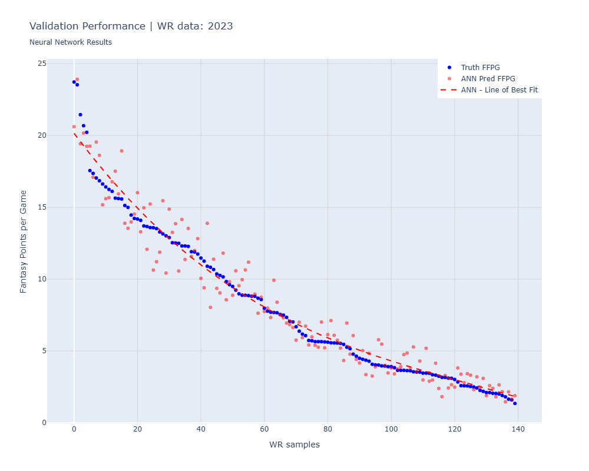

# WR Fantasy Football Points Prediction Neural Network

An Artificial Neural Network (ANN) that predicts Fantasy Football Points per Game (FFPG) for Wide Receivers (WR) based on advanced receiving metrics. The model is trained on NFL data from 2018-2022 seasons and validated on 2023 season data.

## Project Overview

This project uses machine learning to predict wide receiver fantasy football performance by analyzing five key receiving metrics:

### Input Features (WR Metrics)
1. **Targets per Route Run** - Frequency of being targeted when running routes
2. **Yards per Route Run** - Average yards gained per route run
3. **Air Yards Share** - Percentage of team's total air yards
4. **Target Share** - Percentage of team's total targets
5. **Yards After Catch per Reception** - Average YAC per reception

### Model Architecture
- **Input Layer**: 5 features
- **Hidden Layer**: 16 neurons with LeakyReLU activation
- **Output Layer**: 1 neuron with ReLU activation (FFPG prediction)
- **Loss Function**: Mean Squared Error (MSE)
- **Optimizer**: Adam

### Dataset
- **Training Data**: NFL WR statistics from 2018-2022 seasons
- **Validation Data**: NFL WR statistics from 2023 season
- **Target Variable**: Fantasy Points per Game (FFPG)

## Installation & Setup

### Prerequisites
- Python 3.11
- Conda or Miniconda

### Environment Setup

1. **Clone the repository** (or download files):
```bash
git clone <your-repo-url>
cd wr-ffpg-nn
```

2. **Create conda environment from YAML file**:
```bash
conda env create -f environment.yml
```

3. **Activate the environment**:
```bash
conda activate ffpg_nn
```

4. **Verify installation**:
```bash
python -c "import torch; import pandas; import numpy; import matplotlib; import plotly; print('✅ All libraries installed successfully!')"
```

### Required Files
Ensure you have the following data files in your project directory:
- `wr_data_18-22.csv` - Training data (2018-2022 seasons)
- `wr_data_23.csv` - Validation data (2023 season)

## Usage

### Running the Model

1. **Start Jupyter Notebook**:
```bash
jupyter notebook
```

2. **Open and run** `WR_FFPG_NN.ipynb`

3. **Model Training**: The notebook will automatically:
   - Load or train the model (saves weights to `ffpg_model.pt`)
   - Generate interactive training performance plots
   - Validate on 2023 data
   - Display results with player hover tooltips

### Key Features
- **Model Persistence**: Trained model weights are automatically saved and loaded
- **Interactive Visualizations**: Plotly plots with player name and stats on hover
- **Performance Comparison**: Neural network predictions vs. polynomial regression baseline

## Results

The neural network demonstrates promising correlation between the selected WR metrics and fantasy football performance:

### Training Performance (2018-2022 Data)


*The model successfully learns patterns from historical data, with the neural network capturing non-linear relationships better than simple polynomial regression.*

### Validation Performance (2023 Data)


*Validation on 2023 season shows the model's ability to generalize to unseen data, with reasonable predictions for most players.*

### Key Findings
- The 5 selected receiving metrics show strong predictive power for FFPG (R² > 0.94)
- Neural network outperforms polynomial regression by 17% lower MSE on validation data
- Model effectively captures non-linear relationships in fantasy football performance
- Interactive visualizations reveal specific player predictions and performance gaps

### Model Performance Metrics
- **Training Performance**: Neural Network MSE: 2.29, R²: 0.90 vs Polynomial Regression MSE: 2.31, R²: 0.90
- **Validation Performance**: Neural Network MSE: 1.40, R²: 0.95 vs Polynomial Regression MSE: 1.70, R²: 0.94
- **Architecture**: 16-neuron hidden layer proves effective for this dataset
- **Convergence**: Model uses saved weights for consistent results

## Technical Details

### Model Specifications
- **Framework**: PyTorch
- **Device**: CPU (sufficient for this lightweight model)
- **Training Duration**: ~3-5 seconds on modern hardware
- **Model Size**: <1KB saved weights

### Data Preprocessing
- Targets per route run scaled by 100x
- Yards per route run scaled by 10x
- All other metrics used in original scale

### Visualization Technology
- **Training/Validation Plots**: Interactive Plotly visualizations
- **Hover Information**: Player name, season, and FFPG values
- **Regression Lines**: 3rd-degree polynomial trend lines

## Dependencies

See `environment.yml` for complete dependency list. Key packages:
- **PyTorch**: Neural network framework
- **Pandas**: Data manipulation
- **NumPy**: Numerical computations
- **Plotly**: Interactive visualizations
- **Matplotlib**: Additional plotting capabilities
- **Scikit-learn**: Model comparison and metrics
- **Jupyter**: Notebook environment

## Author

**Nikhil Gupta**

---

*This project demonstrates the application of machine learning to fantasy football analytics, providing insights into wide receiver performance prediction using advanced NFL metrics.*